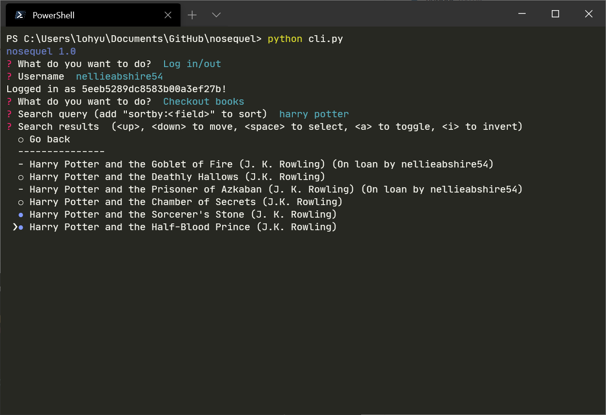

# :blue_book: Nosequel - Y3 CEP Weighted Assessment 3

A basic library app, made with Python and MongoDB

[:page_facing_up: Report](.github/Nosequel%20submission.pdf)

## :camera: Screenshots

## :rocket: Features

### Books

-	Add book (title, authors, isbn, page_count) to library
-	Delete book from library 
-	Edit book information
-	Remove specific attributes from book

### Borrowers

-	Add borrower's (name, username, phone) to library 
-	Delete borrowers from library 
-	Edit borrower information 
- Allow borrowers to checkout/return books (if available)
-	Track number of books checked out by a given user
- Track which user has checked out a book

### Browsing

-	Search by title, authors, or ISBN
-	Sort by title, authors, ISBN or page count
-	Search by name, username 

## :pick: Installation

- Clone this respository
- Rename `config_template.py` to `config.py` and update values
- [requirements.txt](/requirements.txt)

## :computer: Usage

Run `cli.py`

### Sorting

In any search query, append `sortby:<field>` to sort (fields: `title`, `authors`, `isbn`, `page_count`)

## :page_with_curl: License

[GNU General Public License v3.0](https://choosealicense.com/licenses/gpl-3.0/)
